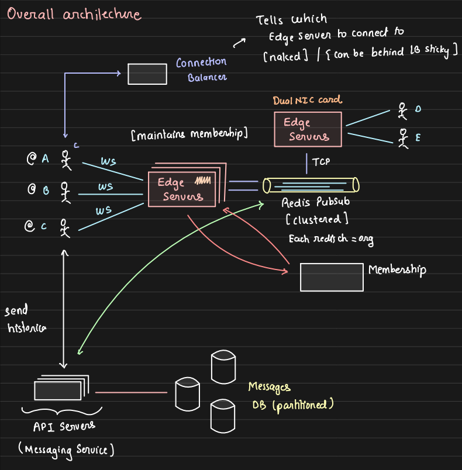

### Architecture

#### Flask server
- [ ] Serves UI ✅
- [ ] Use to manage CRUD calls for users, channels, memberships ✅
- [ ] Use as connection manager to guide users to the websocket server ✅
- [ ] Upon receiving message, persist in database (slack prefers durability over latency as it is an enterprise application) ✅
- [ ] Upon persisting, put the message to redis pub/sub for websockets to consume ✅

#### Websocket server
- [ ] Spawn 2 websocket servers to mimic users from same channel connected to different servers ✅
- [ ] Send message to the relevant user subscribed to channel upon receiving message from pub/sub ✅

### Database - MongoDB
Users
- _id -> user_name
- ...user_info

Channels
- _id -> channel_name
- ...channel_info

Membership
- channel_name
- user_name
- Index - (channel_name)

Messages
- message
- created_at
- sender_name
- channel_name
- Compound Index - (channel_name, user_name)

### Installation
```bash
# Start mongodb container
docker pull mongodb/mongodb-community-server:latest
docker run --name mongodb -p 27017:27017 -d mongodb/mongodb-community-server:latest

# Start redis container
docker run -d --restart unless-stopped --name=redis-darshil-test -p 6380:6379 redis:latest redis-server --timeout 190

# Setup venv
python3 -m venv venv
source venv/bin/activate
export PIP_INDEX_URL=https://pypi.org/simple
pip3 install -r requirements.txt
```

### Run
- Flask server: `python3 -m flask_server.main`
- Websocket server: `python3 -m websocket_servers.ws_server_1`

[slack-prototype.mov](slack-prototype.mov)